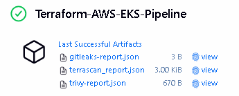
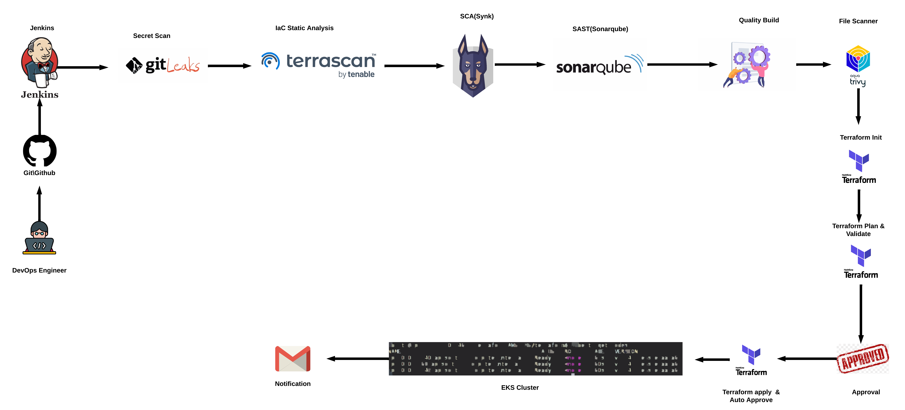
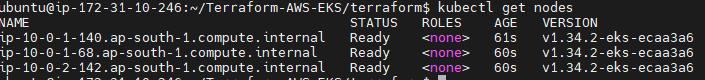

<!-- # 🚀 Terraform EKS Cluster on AWS

This guide provisions an **Amazon Elastic Kubernetes Service (EKS)** cluster using **Terraform**, including configurations for accessing and managing the cluster.

[]()
[]()
[]()
[]()


## 🏗️ Deployment Options

You can deploy this EKS cluster using two methods:

### 🏗️ Project Deployment Flow

<p align="center">
    
</p>

### **Security Tools (DevSecOps)**

```
Secret Scanning:
└── Gitleaks          # Detect hardcoded secrets

Dependency Scanning (SCA):
└── Snyk              # Software Composition Analysis

Code Quality (SAST):
└── SonarQube         # Static Application Security Testing

Filesystem Security:
└── Trivy             # Vulnerability Scanner

Terraform Code Scanning:
└── Terrascan         # Terraform Code Scan

```

## 📊 Pipeline Results

### **Jenkins Pipeline View**

<p align="center">
    
</p>

### **Report View**

<p align="center">
    
</p>

### **AWS EKS Cluster View**

<p align="center">
    
</p>

---

## Option 1: CI/CD Pipeline (Recommended)

This project is optimized for a DevSecOps pipeline using Jenkins.

### 🛠️ Prerequisites

**Step 1: Setup AWS CLI and IAM User**

```bash
# 1. Install AWS CLI
curl "https://awscli.amazonaws.com/awscli-exe-linux-x86_64.zip" -o "awscliv2.zip"
sudo apt install unzip -y && unzip awscliv2.zip && sudo ./aws/install

# 2. Create Admin User for Pipeline
aws iam create-user --user-name jenkins-eks-admin

# 3. Create and Attach Policy
cat <<EOF > policy.json
{
  "Version": "2012-10-17",
  "Statement": [
    {
      "Effect": "Allow",
      "Action": ["eks:*", "ec2:*", "iam:*", "vpc:*", "autoscaling:*", "cloudformation:*"],
      "Resource": "*"
    }
  ]
}
EOF

aws iam create-policy --policy-name EKS-Admin-Policy --policy-document file://policy.json
aws iam attach-user-policy --user-name jenkins-eks-admin --policy-arn $(aws iam list-policies --query 'Policies[?PolicyName==`EKS-Admin-Policy`].Arn' --output text)

# 4. Generate Access Keys
aws iam create-access-key --user-name jenkins-eks-admin
```

**⚠️ Important:** Save the Access Key ID and Secret Access Key generated in Step 4. You will need to run `aws configure` and provide these keys to authorize the pipeline.

**Step 2:** Install Jenkins Plugins

- Pipeline: AWS Steps
- SonarQube Scanner
- Docker

**Step 3:** Configure Credentials

- Add `aws-creds`, `sonar`, and `snyk_cred` in Jenkins Credentials Manager

**Step 4:** Install Tools

- Ensure `terraform`, `terrascan`, and `trivy` are installed on the Jenkins agent

---

## Option 2: Manual Deployment (CLI)

Use this method for local testing or quick deployment.

### 🛠️ Prerequisites

Ensure the following tools are installed and configured:

#### 1. Install AWS CLI v2

```bash
curl "https://awscli.amazonaws.com/awscli-exe-linux-x86_64.zip" -o "awscliv2.zip"
sudo apt install unzip -y
unzip awscliv2.zip
sudo ./aws/install
aws --version
```

#### 2. Install kubectl

```bash
curl -LO "https://dl.k8s.io/release/$(curl -L -s https://dl.k8s.io/release/stable.txt)/bin/linux/amd64/kubectl"
sudo install -o root -g root -m 0755 kubectl /usr/local/bin/kubectl
kubectl version --client
```

#### 3. Install Terraform

```bash
sudo apt-get update && sudo apt-get install -y gnupg software-properties-common
wget -O- https://apt.releases.hashicorp.com/gpg | gpg --dearmor | sudo tee /usr/share/keyrings/hashicorp-archive-keyring.gpg > /dev/null
echo "deb [signed-by=/usr/share/keyrings/hashicorp-archive-keyring.gpg] https://apt.releases.hashicorp.com $(lsb_release -cs) main" | sudo tee /etc/apt/sources.list.d/hashicorp.list
sudo apt update && sudo apt-get install terraform
terraform --version
```

---

### 🔐 IAM Setup (Programmatic Access)

Run these commands to create a dedicated IAM user for Jenkins/Terraform.

#### Step 1: Create IAM User

```bash
aws iam create-user --user-name jenkins-eks-admin
```

#### Step 2: Create Policy File

```bash
cat <<EOF > policy.json
{
  "Version": "2012-10-17",
  "Statement": [
    {
      "Effect": "Allow",
      "Action": [
        "eks:*",
        "ec2:*",
        "iam:*",
        "vpc:*",
        "autoscaling:*",
        "cloudformation:*"
      ],
      "Resource": "*"
    }
  ]
}
EOF
```

#### Step 3: Attach Policy

```bash
# Create custom policy
aws iam create-policy --policy-name EKS-Admin-Policy --policy-document file://policy.json

# Attach it (Using AdministratorAccess for learning — use EKS-Admin-Policy in production)
aws iam attach-user-policy --user-name jenkins-eks-admin --policy-arn arn:aws:iam::aws:policy/AdministratorAccess
```

#### Step 4: Generate Access Keys

```bash
aws iam create-access-key --user-name jenkins-eks-admin
```

**⚠️ Important:** Save the `AccessKeyId` and `SecretAccessKey` from the output **securely**.

---

## 🚀 Deploy EKS Cluster

### 1️⃣ Authentication

Configure your AWS CLI with the keys generated above:

```bash
aws configure
```

Enter:

- **Access Key ID:** (from Step 4)
- **Secret Access Key:** (from Step 4)
- **Default region name:** `ap-south-1` (or your preferred region)
- **Default output format:** `json`

### 2️⃣ Initialize Terraform

```bash
cd TERRAFORM-AWS-EKS/terraform/
terraform init
```

### 3️⃣ Validate, Plan and Deploy

```bash
terraform validate
terraform plan
terraform apply --auto-approve
```

**⏳ Wait:** 10–15 minutes for AWS to provision the cluster.

### 4️⃣ Configure kubectl

Connect your local `kubectl` to the new EKS cluster:

```bash
aws eks --region ap-south-1 update-kubeconfig --name <cluster-name>
```

Verify connection:

```bash
kubectl get nodes
```

---

## 🧹 Cleanup

To avoid unnecessary AWS costs, destroy the resources when you're done:

```bash
terraform destroy --auto-approve
```

---

## 🤝 Contributing

Feel free to submit issues and pull requests to improve this project! -->

# 🚀 Production-Ready EKS Cluster on AWS with DevSecOps Pipeline

[]()
[]()
[]()
[]()
[]()

> **Enterprise-grade Amazon Elastic Kubernetes Service (EKS) infrastructure as code with integrated DevSecOps security scanning**

This repository provides a complete, production-ready Terraform configuration for deploying Amazon EKS clusters with built-in security scanning, automated CI/CD pipelines, and comprehensive documentation.

---

## 📋 Table of Contents

- [Features](#-features)
- [Architecture](#-architecture)
- [Quick Start](#-quick-start)
- [Deployment Options](#-deployment-options)
- [Security Tools](#-security-tools-devsecops)
- [Prerequisites](#-prerequisites)
- [Pipeline Results](#-pipeline-results)
- [Configuration](#-configuration)
- [Cleanup](#-cleanup)
- [Troubleshooting](#-troubleshooting)
- [Contributing](#-contributing)
- [License](#-license)

---

## ✨ Features

- 🔒 **Security-First Approach** - Integrated vulnerability scanning with Trivy, Snyk, and Terrascan
- 📊 **Code Quality** - SonarQube integration for static code analysis
- 🔑 **Secret Detection** - Gitleaks scanning to prevent credential leaks
- 🏗️ **Infrastructure as Code** - Fully automated EKS provisioning with Terraform
- ⚡ **Multi-AZ Deployment** - High availability across availability zones
- 🛡️ **IAM Best Practices** - Principle of least privilege access controls
- 📈 **Scalable Architecture** - Auto-scaling node groups
- 🔍 **Comprehensive Monitoring** - Ready for CloudWatch and Prometheus integration

---

## 🏗️ Architecture

### Infrastructure Overview

```
┌─────────────────────────────────────────────────────────────┐
│                         AWS Cloud                            │
│  ┌───────────────────────────────────────────────────────┐  │
│  │                    VPC (Multi-AZ)                      │  │
│  │  ┌──────────────┐  ┌──────────────┐  ┌─────────────┐ │  │
│  │  │ Public Subnet│  │ Public Subnet│  │   NAT GW    │ │  │
│  │  │   (AZ-1)     │  │   (AZ-2)     │  │             │ │  │
│  │  └──────────────┘  └──────────────┘  └─────────────┘ │  │
│  │  ┌──────────────┐  ┌──────────────┐                  │  │
│  │  │Private Subnet│  │Private Subnet│                  │  │
│  │  │   (EKS)      │  │   (EKS)      │                  │  │
│  │  └──────────────┘  └──────────────┘                  │  │
│  │         │                  │                          │  │
│  │  ┌──────▼──────────────────▼──────┐                  │  │
│  │  │    EKS Control Plane           │                  │  │
│  │  │  ┌────────┐    ┌────────┐     │                  │  │
│  │  │  │ Node 1 │    │ Node 2 │     │                  │  │
│  │  │  └────────┘    └────────┘     │                  │  │
│  │  └────────────────────────────────┘                  │  │
│  └───────────────────────────────────────────────────────┘  │
└─────────────────────────────────────────────────────────────┘
```

### DevSecOps Pipeline Flow

<p align="center">
    
</p>

---

## 🔐 Security Tools (DevSecOps)

Our integrated security scanning pipeline includes:

| Tool          | Purpose                                       | Stage        |
| ------------- | --------------------------------------------- | ------------ |
| **Gitleaks**  | Secret & credential detection                 | Pre-commit   |
| **Snyk**      | Dependency vulnerability scanning (SCA)       | Build        |
| **SonarQube** | Static Application Security Testing (SAST)    | Code Quality |
| **Trivy**     | Container & filesystem vulnerability scanning | Image Scan   |
| **Terrascan** | Infrastructure as Code security scanning      | Terraform    |

```
Security Scanning Pipeline:
├── 🔍 Secret Scanning
│   └── Gitleaks          # Detect hardcoded secrets & API keys
├── 📦 Dependency Scanning (SCA)
│   └── Snyk              # Software Composition Analysis
├── 🎯 Code Quality (SAST)
│   └── SonarQube         # Static Application Security Testing
├── 🖼️ Container Security
│   └── Trivy             # Multi-layer vulnerability scanner
└── 🏗️ IaC Security
    └── Terrascan         # Terraform policy validation
```

---

## 📊 Pipeline Results

### Jenkins Pipeline Execution

<p align="center">
    
</p>

### Security Reports Dashboard

<p align="center">
    
</p>

### AWS EKS Cluster

<p align="center">
    
</p>

---

## 🛠️ Prerequisites

### Required Tools

| Tool      | Version | Installation Guide                                                                               |
| --------- | ------- | ------------------------------------------------------------------------------------------------ |
| AWS CLI   | v2.x    | [Install AWS CLI](https://docs.aws.amazon.com/cli/latest/userguide/getting-started-install.html) |
| Terraform | v1.0+   | [Install Terraform](https://developer.hashicorp.com/terraform/downloads)                         |
| kubectl   | v1.28+  | [Install kubectl](https://kubernetes.io/docs/tasks/tools/)                                       |
| Jenkins   | v2.400+ | [Install Jenkins](https://www.jenkins.io/doc/book/installing/)                                   |

### AWS Account Requirements

- Active AWS Account
- IAM permissions to create EKS, VPC, EC2, and IAM resources
- AWS CLI configured with valid credentials

---

## 🚀 Quick Start

### 1. Clone Repository

```bash
git clone https://github.com/17J/Terraform-AWS-EKS.git
cd Terraform-AWS-EKS
```

### 2. Configure AWS Credentials

```bash
aws configure
# Enter your AWS Access Key ID
# Enter your AWS Secret Access Key
# Default region: ap-south-1
# Default output format: json
```

### 3. Deploy Infrastructure

```bash
cd terraform/
terraform init
terraform plan
terraform apply -auto-approve
```

### 4. Configure kubectl

```bash
aws eks update-kubeconfig --region ap-south-1 --name <your-cluster-name>
kubectl get nodes
```

**🎉 Your EKS cluster is now ready!**

---

## 🏗️ Deployment Options

### Option 1: CI/CD Pipeline (Recommended for Production)

Automated deployment using Jenkins with integrated security scanning.

#### Jenkins Setup

**Step 1: Install Required Plugins**

Navigate to `Manage Jenkins` → `Manage Plugins` → `Available` and install:

- Pipeline: AWS Steps
- SonarQube Scanner
- Docker Pipeline
- Terraform
- Pipeline Utility Steps

**Step 2: Configure Global Tools**

Go to `Manage Jenkins` → `Global Tool Configuration`:

```
Terraform:
  Name: terraform-1.6
  Install automatically: ✓
  Version: 1.6.0

SonarQube Scanner:
  Name: sonar-scanner
  Install automatically: ✓
```

**Step 3: Add Credentials**

Navigate to `Manage Jenkins` → `Manage Credentials` → `System` → `Global credentials`:

| ID          | Type            | Description                    |
| ----------- | --------------- | ------------------------------ |
| `aws-creds` | AWS Credentials | AWS Access Key & Secret        |
| `sonar`     | Secret text     | SonarQube authentication token |
| `snyk_cred` | Secret text     | Snyk API token                 |

**Step 4: Create Pipeline Job**

1. New Item → Pipeline
2. Configure → Pipeline Definition: **Pipeline script from SCM**
3. SCM: Git
4. Repository URL: `https://github.com/17J/Terraform-AWS-EKS.git`
5. Script Path: `Jenkinsfile`
6. Save and Build

#### IAM User Setup for Pipeline

```bash
# 1. Create dedicated IAM user
aws iam create-user --user-name jenkins-eks-admin

# 2. Create custom policy
cat <<EOF > eks-admin-policy.json
{
  "Version": "2012-10-17",
  "Statement": [
    {
      "Effect": "Allow",
      "Action": [
        "eks:*",
        "ec2:*",
        "iam:PassRole",
        "iam:CreateRole",
        "iam:DeleteRole",
        "iam:AttachRolePolicy",
        "iam:DetachRolePolicy",
        "vpc:*",
        "autoscaling:*",
        "cloudformation:*",
        "logs:*"
      ],
      "Resource": "*"
    }
  ]
}
EOF

# 3. Create and attach policy
aws iam create-policy \
  --policy-name EKS-Admin-Policy \
  --policy-document file://eks-admin-policy.json

aws iam attach-user-policy \
  --user-name jenkins-eks-admin \
  --policy-arn $(aws iam list-policies --query 'Policies[?PolicyName==`EKS-Admin-Policy`].Arn' --output text)

# 4. Generate access keys
aws iam create-access-key --user-name jenkins-eks-admin
```

**⚠️ IMPORTANT:** Save the `AccessKeyId` and `SecretAccessKey` securely. You'll need them for Jenkins credentials.

---

### Option 2: Manual Deployment (For Testing/Development)

Perfect for local testing, learning, or quick deployments.

#### Install Required Tools

**AWS CLI v2:**

```bash
curl "https://awscli.amazonaws.com/awscli-exe-linux-x86_64.zip" -o "awscliv2.zip"
sudo apt install unzip -y
unzip awscliv2.zip
sudo ./aws/install
aws --version
```

**kubectl:**

```bash
curl -LO "https://dl.k8s.io/release/$(curl -L -s https://dl.k8s.io/release/stable.txt)/bin/linux/amd64/kubectl"
sudo install -o root -g root -m 0755 kubectl /usr/local/bin/kubectl
kubectl version --client
```

**Terraform:**

```bash
sudo apt-get update && sudo apt-get install -y gnupg software-properties-common
wget -O- https://apt.releases.hashicorp.com/gpg | \
  gpg --dearmor | \
  sudo tee /usr/share/keyrings/hashicorp-archive-keyring.gpg > /dev/null

echo "deb [signed-by=/usr/share/keyrings/hashicorp-archive-keyring.gpg] \
  https://apt.releases.hashicorp.com $(lsb_release -cs) main" | \
  sudo tee /etc/apt/sources.list.d/hashicorp.list

sudo apt update && sudo apt-get install terraform
terraform --version
```

#### Deploy Manually

```bash
# Navigate to terraform directory
cd terraform/

# Initialize Terraform
terraform init

# Review planned changes
terraform plan

# Apply configuration
terraform apply -auto-approve

# Wait 10-15 minutes for provisioning

# Configure kubectl
aws eks update-kubeconfig --region ap-south-1 --name <cluster-name>

# Verify cluster
kubectl get nodes
kubectl get pods --all-namespaces
```

---

## ⚙️ Configuration

### Customize Your Deployment

Edit `terraform/variables.tf` to modify:

```hcl
variable "cluster_name" {
  description = "EKS cluster name"
  default     = "my-eks-cluster"
}

variable "region" {
  description = "AWS region"
  default     = "ap-south-1"
}

variable "node_instance_type" {
  description = "EC2 instance type for worker nodes"
  default     = "t3.medium"
}

variable "desired_capacity" {
  description = "Desired number of worker nodes"
  default     = 2
}

variable "max_capacity" {
  description = "Maximum number of worker nodes"
  default     = 4
}

variable "min_capacity" {
  description = "Minimum number of worker nodes"
  default     = 1
}
```

### Network Configuration

The default VPC setup includes:

- **CIDR Block:** `10.0.0.0/16`
- **Public Subnets:** 2 (across different AZs)
- **Private Subnets:** 2 (for EKS worker nodes)
- **NAT Gateway:** Enabled for private subnet internet access
- **Internet Gateway:** For public subnet connectivity

---

## 🧹 Cleanup

### Destroy Infrastructure

To avoid ongoing AWS charges, destroy all resources when finished:

```bash
cd terraform/
terraform destroy -auto-approve
```

### Verify Deletion

```bash
# Check EKS clusters
aws eks list-clusters --region ap-south-1

# Check EC2 instances
aws ec2 describe-instances --region ap-south-1 --query 'Reservations[].Instances[?State.Name==`running`]'

# Check VPCs
aws ec2 describe-vpcs --region ap-south-1
```

---

## 🐛 Troubleshooting

### Common Issues

**Issue: Terraform state lock**

```bash
# Force unlock (use with caution)
terraform force-unlock <LOCK_ID>
```

**Issue: kubectl cannot connect**

```bash
# Reconfigure kubeconfig
aws eks update-kubeconfig --region ap-south-1 --name <cluster-name>

# Check AWS credentials
aws sts get-caller-identity
```

**Issue: Nodes not joining cluster**

```bash
# Check node group status
aws eks describe-nodegroup --cluster-name <cluster-name> --nodegroup-name <nodegroup-name>

# View CloudWatch logs
aws logs tail /aws/eks/<cluster-name>/cluster --follow
```

**Issue: Security group errors**

```bash
# Verify security group rules
aws ec2 describe-security-groups --region ap-south-1 --filters "Name=tag:Name,Values=*eks*"
```

---

## 🤝 Contributing

We welcome contributions! Please follow these steps:

1. Fork the repository
2. Create a feature branch (`git checkout -b feature/amazing-feature`)
3. Commit your changes (`git commit -m 'Add amazing feature'`)
4. Push to the branch (`git push origin feature/amazing-feature`)
5. Open a Pull Request

### Code Style Guidelines

- Use consistent Terraform formatting: `terraform fmt`
- Validate configurations: `terraform validate`
- Follow AWS naming conventions
- Document all variables and outputs
- Include examples for complex configurations

---

## 📄 License

This project is licensed under the MIT License - see the [LICENSE](LICENSE) file for details.

---

## 👥 Authors

- **Rahul Joshi** - _Initial work_ - [17J](https://github.com/17J)

---

<p align="center">
  Made with ❤️ for the DeSecvOps Community
</p>

<p align="center">
  <a href="#-production-ready-eks-cluster-on-aws-with-devsecops-pipeline">⬆️ Back to Top</a>
</p>
